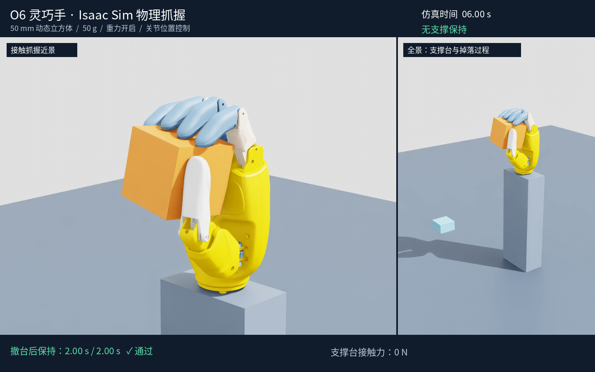

# 结营项目报告：基于 Isaac Sim 的 O6 灵巧手抓握仿真

| 项目 | 内容 |
|---|---|
| 学员姓名 | 【请填写】 |
| 训练营名称 / 期数 | 【请填写】 |
| 项目方向 | 任务 3：灵巧手抓取仿真项目 |
| 使用手型 | LinkerHand O6 右手 |
| 完成日期 | 【请填写】 |
| 代码仓库地址 | 【上传后填写】 |

## 一、复现项目与灵巧手模型修改说明

本项目基于开源项目 [linkerhand_isaaclab_patch](https://github.com/ZzXwANT/linkerhand_isaaclab_patch) 的 **O6 灵巧手 USD 资产及 Isaac Lab 手型适配思路**进行二次开发。上游项目提供了 LinkerHand 手型在 Isaac Lab 中的手内操作任务适配，本项目复用 O6 模型，在 Isaac Sim 中重新构建独立的抓握场景，实现以下目标：

> O6 手指闭合夹住启用重力的动态立方体，支撑台撤走后保持至少两秒，随后张手使立方体自然掉落。

本次工作采用关节位置控制，不涉及上游 PPO 策略训练、奖励函数优化或手内旋转策略的复现。模型本身已经是 O6，因此没有进行“将其他手型替换为 O6”的操作，而是对现有 O6 模型进行了碰撞、驱动和联动控制适配。

原始资源为 `linkerhand_isaaclab_patch/model/o6_right_hand/o6_hand.usd`，在成果中保存为 `assets/o6_hand.usd`。原始文件保持不变，模型修改在脚本创建的新场景中执行，主要包括：

1. 将 O6 引用到 `/World/Hand`，保留原有固定基座，将手腕安装到 0.22 m 高的位置。
2. 保留几何网格、连杆尺寸、关节层级和原有凸包碰撞网格，为碰撞体配置摩擦及接触参数。
3. 移除运行场景中的原生 PhysX mimic 约束，改用软件生成联动位置目标。
4. 根据源 URDF 的联动比例，将四指 DIP 目标设为对应 MCP 的 0.89 倍，将拇指 IP 目标设为 CMC pitch 的 1.86 倍。
5. 为十一旋转关节配置位置驱动，并调整求解器迭代参数，以完成平滑闭合、保持和释放。

六个逻辑控制量分别为四指 MCP，以及拇指 CMC yaw、pitch。它们被展开为十一关节的位置目标。该方式是本演示使用的软件联动近似，不等同于对实物传动机构的精确建模。

## 二、项目背景与目标

灵巧手抓握不仅需要手指运动，还需要物体与手指之间形成有效接触，并在重力作用下保持稳定。仅展示手指闭合，或者物体静止在手边，不能充分说明抓握成功。

因此，本项目使用“撤走外部支撑”和“张手后自然掉落”两个步骤辅助验证抓握效果。方块在整个抓握过程中保持动态刚体属性，依靠手指接触承受重力；控制脚本不在抓握过程中直接修改方块姿态，也不对方块添加固定关节或吸附约束。

项目目标包括：

- 在 Isaac Sim 中加载并驱动 O6 灵巧手。
- 实现手指闭合、夹住动态立方体和支撑台撤离。
- 在支撑台完全移开后保持至少两秒。
- 张手后使方块自然掉落，形成释放验证。
- 提交可运行代码、演示视频、物理状态日志和自动验收结果。

## 三、实验环境与资源

### 3.1 实验环境

| 项目 | 本机配置 |
|---|---|
| 操作系统 | Ubuntu 22.04.5 |
| Isaac Sim | 5.0.0 RC 构建 |
| Isaac Lab | 2.2.0 |
| Python | Isaac Sim 自带 Python 3.11 |
| GPU | NVIDIA RTX5880-Ada-8Q，8 GB 显存 |
| 驱动版本 | 570.172.18 |
| 物理仿真 | CPU PhysX，240 Hz |
| 相机与日志频率 | 30 Hz |

Isaac Lab 在本项目中提供 Kit 启动配置，场景与控制逻辑使用 Isaac Sim Python API 构建。模型和地面均由本地资源或程序生成，运行时不需要下载远程场景。

### 3.2 模型与来源

- 手型：LinkerHand O6 右手。
- 仿真模型：`assets/o6_hand.usd`。
- 补丁项目：`ZzXwANT/linkerhand_isaaclab_patch`。
- 关联官方 URDF 项目：`linker-bot/linkerhand-urdf`。
- 本地补丁提交：`8a31655ea3172ea1c3c27e3008ff8963b6bda47c`。

USD 是本机已有的附加资源，上述提交号不表示该 USD 必然由该提交追踪。详细来源和文件哈希保留在 [PROVENANCE.md](PROVENANCE.md) 中。

## 四、方案设计与实现

### 4.1 场景组成

场景由固定手腕的 O6 灵巧手、动态立方体、可移动支撑台、地面和相机构成。

| 对象 | 设置 |
|---|---|
| 立方体 | 边长 0.05 m，质量 0.05 kg，重力开启 |
| 方块初始位置 | `(0.043, 0, 0.315)` m |
| 手腕安装高度 | 0.22 m |
| 支撑台 | 尺寸 `0.032 × 0.032 × 0.018` m，运动学刚体 |
| 撤台位移 | 侧移 0.16 m，同时下降 0.13 m |
| 相机 | 抓握近景和场景全景两个同步视角 |

固定的是手腕基座，方块始终是动态物体。支撑台仅用于初始放置，保持阶段已与方块分离。

### 4.2 关节控制

控制采用平滑插值的位置目标。对于归一化进度 `u`，使用 `3u²−2u³` 生成闭合或张开进度，减少目标位置突变。

默认闭合目标为：

| 控制量 | 目标值 |
|---|---:|
| 四指 MCP | 1.30 rad |
| 拇指 CMC yaw | 1.20 rad |
| 拇指 CMC pitch | 0.50 rad |
| 四指 DIP | 各自 MCP 目标的 0.89 倍 |
| 拇指 IP | CMC pitch 目标的 1.86 倍 |

位置目标用于驱动关节运动；手指遇到物体时，实际关节位置由接触和驱动力共同决定，并非直接将手指或方块摆放到某一姿态。

### 4.3 物理参数

| 参数 | 数值 |
|---|---:|
| 静摩擦系数 | 1.2 |
| 动摩擦系数 | 1.0 |
| 恢复系数 | 0 |
| 接触偏移 / 静止偏移 | 0.001 m / 0 m |
| 驱动 stiffness / damping / maxForce | 3 / 0.12 / 0.5 |
| 位置 / 速度求解迭代 | 32 / 4 |
| 手部自碰撞 | 关闭 |

以上为本场景调试采用的仿真设置，未经过实物参数标定。

### 4.4 动作流程

| 仿真时间 | 阶段 |
|---|---|
| 0–1 s | 方块在支撑台上稳定，手指保持打开 |
| 1–3 s | 手指平滑闭合 |
| 3–4 s | 支撑台向侧面和下方撤离 |
| 4–7 s | 保持关节目标，方块无外部支撑 |
| 7–8 s | 手指张开，释放方块 |
| 8–9 s | 观察方块落到地面 |

### 4.5 调试中解决的问题

初期测试中，程序能够创建场景，但默认视口等待和远程默认地面资源增加了启动的不确定性。通过显式创建场景、使用合适的 Kit 配置和本地程序化地面，运行流程得以稳定。

在抓握调试中，原生 mimic 约束下出现了关节运动异常。随后改为基于 URDF 比例的软件联动，并调整支撑台尺寸，减小其与手部运动的干涉。方块位置、驱动目标和接触参数共同调整后，实现了撤台保持。

录制时还出现了物理位置与画面不同步的问题。最终关闭该场景的 Fabric 物理姿态输出，启用 USD 更新，并显式同步运动学支撑台的视觉位置，使视频能正确显示支撑台撤离和方块运动。

## 五、实验验证与结果

### 5.1 验收方法

使用独立脚本 `verify.py` 检查物理记录，验收条件为：

1. 记录覆盖撤台后的连续两秒以上。
2. 方块保持在抓握高度附近，期间最大三维位移小于 10 mm。
3. 方块与支撑台的保守包围球间存在明确间隔。
4. 支撑台接触法向力为零，手指接触法向力非零。
5. 张手后方块下降超过 80 mm。

日志以 30 Hz 保存仿真时间、方块位置与姿态、速度、关节角和接触法向力向量。验收依据物理状态，不仅依赖视频中的视觉判断。

### 5.2 实测结果

| 指标 | 本次记录 |
|---|---:|
| 连续验收时长 | 2.066666 仿真秒 |
| 保持阶段中心高度 | 约 0.313002 m |
| 保持期间最大三维位移 | 0.002256 mm |
| 支撑台接触法向力 | 0 N |
| 手指接触法向力模长之和的最小值 | 8.57448 N |
| 方块与支撑台包围球间隔下界 | 0.16134 m |
| 张手后的下降距离 | 0.28800 m |
| 验收结果 | 全部通过 |

最终参数下的录制运行与从成果目录重新启动的物理复现均通过验收。重复运行采用相同初始条件，不能据此推断随机场景或其他物体的成功率。

### 5.3 成果展示



- [双视角演示视频](results/O6_grasp_demo.mp4)
- [原始近景视频](results/grasp_raw.mp4)
- [原始全景视频](results/overview_raw.mp4)
- [逐帧状态和接触日志](results/trajectory.json)
- [验收结果](results/verification.json)

视频生成方式：使用 Isaac Sim 内置 Camera API 渲染两路相机画面，再用 Python imageio/FFmpeg 编码为 MP4；并非调用 Isaac Sim 界面中的录屏按钮。GUI 窗口展示的仍是实时运行的物理仿真。

双视角视频前九秒为原速仿真画面，最后两秒为验收结果页。视频展示了闭合、撤台、保持及张手掉落全过程。

## 六、代码结构与成果提交范围

本报告位于最终提交目录 `O6_final_submission`。将该目录内的内容作为代码仓库根目录，或提交同名 ZIP 即可；完整清单见 [SUBMISSION.md](SUBMISSION.md)。运行机器需自行安装 Isaac Sim 和 Isaac Lab，无需把它们的安装目录放入成果包。

```text
.
├── README.md                 # 本结营报告
├── RUNNING.md                # 详细运行帮助与常见问题
├── SUBMISSION.md             # 最终提交文件清单
├── PROVENANCE.md             # 上游来源说明
├── .gitignore                # 排除缓存与新生成的运行输出
├── grasp_demo.py             # 场景、控制、接触记录和录制
├── verify.py                 # 独立验收脚本
├── compose_video.py          # 双视角字幕视频合成
├── run.sh                    # 默认打开交互窗口
├── start_isaacsim.sh          # Isaac Sim 窗口启动入口
├── run_recording.sh          # 无窗口自动录制入口
├── assets/o6_hand.usd         # 必需的 O6 模型
├── results/                  # 视频、预览图、参数和验收记录
└── SHA256SUMS.json            # 文件校验清单
```

主要新增工作集中在 `grasp_demo.py`、`verify.py` 和 `compose_video.py`。`assets/` 为复用模型，`results/` 为实验成果。临时调试目录、缓存、完整软件环境和重复场景快照不属于上传必需内容。

## 七、运行与复现步骤

以下命令均在项目根目录执行，使用本机默认安装路径。

### 7.1 启动 Isaac Sim 并观看完整过程

```bash
bash run.sh
```

此命令打开 Isaac Sim 图形窗口。场景加载后，在 `O6 Grasp Demo` 面板点击 **Start grasp**，三秒后开始完整抓握流程；`Whole scene` / `Close-up` 可切换全景与近景。结束后窗口保持打开，关闭窗口才退出程序。相机视频和日志保存在 `outputs/interactive/`。

需要无窗口自动录制及合成视频时，执行 `bash run_recording.sh`，成片保存到 `outputs/run/O6_grasp_demo.mp4`。

### 7.2 打开窗口手动录屏

```bash
/opt/IsaacSim/python.sh grasp_demo.py \
  --gui --wait-for-start --keep-open \
  --output outputs/manual_recording
```

等待场景加载后开启录屏，在 Isaac Sim 的 `O6 Grasp Demo` 面板点击 **Start grasp**。三秒后开始演示，无需点击时间轴 Play。也可以在终端按回车启动。演示结束后窗口保留，关闭窗口退出。

### 7.3 独立验收与合成视频

```bash
python3 verify.py results

/opt/IsaacSim/python.sh compose_video.py outputs/manual_recording
```

安装路径配置、依赖说明及故障排查详见 [RUNNING.md](RUNNING.md)。

## 八、不足与后续改进

本项目完成了一个固定初始条件下的抓握验证，但仍存在以下限制：

- 只验证了单个尺寸和质量的立方体，未测试多物体或随机初始位置。
- 采用固定关节目标，没有视觉定位、在线抓取规划或强化学习策略。
- 软件联动近似与真实机械传动存在差异，尚未进行实物标定和迁移。
- 手部自碰撞关闭，模型接触参数需要进一步通过实验校准。
- 微小位移是该次物理仿真的数值结果，不能作为实物控制精度指标。

后续可以增加方块尺寸、质量和初始姿态扰动，统计多次试验结果；进一步引入接触反馈控制、更多物体和机械臂，将当前固定场景扩展为完整的抓取任务。

## 九、项目总结

本项目完成了从 O6 模型加载、关节驱动和接触参数适配，到支撑台撤离、保持验证、释放验证及视频录制的完整流程。实验表明，在所设定场景与参数下，O6 能依靠手指接触夹住动态立方体，撤台后连续保持超过两秒，并在张手后使方块自然掉落。

成果包含可运行代码、模型来源说明、原始视频和独立验收记录，能够用于本次灵巧手抓握仿真任务的展示与复现。

